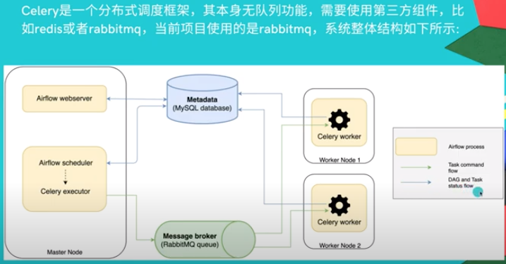

# 介绍

* airflow 是一个编排、调度和监控workflow的平台。
  * 由Airbnb开源，现在在Apache Software Foundation 孵化。
  * airflow 将workflow编排为由tasks组成的DAGs(有向无环图)，调度器在一组workers上按照指定的依赖关系执行tasks。
  * airflow 提供了丰富的命令行工具和简单易用的用户界面以便用户查看和操作，并且airflow提供了监控和报警系统。
  * Airflow管道使用Jinja模版引擎，可以动态生成。

* crontab的不足：
  * 多任务之间依赖，任务消耗时间
  * 进度查看和执行日志，历史调度情况
  * 出错重试和报警

* 同类付费软件：Informatica，Talend，Control-M，Fivetran
* ETL 痛点：
  * 日益增加数据量和不均衡峰值
  * 快速排查任务失败原因，重试，监控，报警
  * 新工具配置规范，敏捷开发


# 概念

* DAGs：即有向无环图(Directed Acyclic Graph)，将所有需要运行的tasks按照依赖关系组织起来，描述的是所有tasks执行的顺序。

* Operators：airflow内置了很多operators，如：

  * BashOperator 执行一个bash 命令
  * PythonOperator 调用任意的Python 函数
  * EmailOperator 用于发送邮件
  * HTTPOperator 用于发送HTTP请求
  * SqlOperator 用于执行SQL命令
  * 用户可以自定义Operator，这给用户提供了极大的便利性。可以理解为用户需要的一个操作,是Airflow提供的类

* Tasks：Task 是 Operator的一个实例

  * Task Instance：由于Task会被重复调度，每次task的运行就是不同的task instance了。
  * Task instance 有自己的状态，包括"running", "success", "failed", "skipped", "up for retry"等。
  * Task Relationships：DAGs中的不同Tasks之间可以有依赖关系

* Executor：执行器，任务具体怎样运行

  * SequentialExecutor：单进程顺序执行任务，默认执行器，通常只用于测试。

  * LocalExecutor：多进程本地执行任务。

  * CeleryExecutor：分布式调度，生产常用。需要依赖三方队列redis或rabbitmq。任务由Master node的Celery executor发送到队列里，Worker node上的Celery worker接收任务进行。

    

  * DaskExecutor：动态任务调度，主要用于数据分析。


# 安装

```bash
#如果考虑虚拟环境
python3 -m venv /path/to/new/env

# 安装指南
https://airflow.apache.org/docs/apache-airflow/stable/start/local.html

export AIRFLOW_HOME=~/airflow
# install from pypi using pip
pip install apache-airflow
# initialize the database
airflow initdb
# start the web server, default port is 8080
airflow webserver -p 8080
# start the scheduler
airflow scheduler
# visit localhost:8080 in the browser and enable the example dag in the home page

# 注意，默认单机airflow是用本机sqlite存储，高可用需要考虑切换为MySQL或PG
```

# DAG 格式

```python
from datetime import datetime, timedelta
import airflow
from airflow.models import Variable
# 常用 Operator
from airflow.operators.postgres_operator import PostgresOperator
from airflow.operators.dummy_operator import DummyOperator

# Airflow 默认参数
args = {
    'owner': 'airflow',
    'depends_on_past': False,
    'start_date': datetime(2019, 7, 26), #start_date会决定这个DAG从哪天开始生效
    'email': ['airflow@example.com'],
    'email_on_failure': False,
    'email_on_retry': False,
    'retries': 1,
    'retry_delay': timedelta(minutes=5),
    # 'queue': 'bash_queue',
    # 'pool': 'backfill',
    # 'priority_weight': 10,
    # 'end_date': datetime(2016, 1, 1),
}
# Variable是Airflow提供的用户自定义变量的功能,在UI界面的Admin -> Variable下可以进行增删改查
tmpl_search_path = Variable.get("sql_path")  

#dag图
dag = airflow.DAG(
    'test_param_sql',
    schedule_interval=timedelta(days=1), # schedule_interval是调度的频率
    template_searchpath=tmpl_search_path, # 查找相关文件的路径，如 .sql 文件
    default_args=args,
    max_active_runs=1)

#各种Operator

'''
param_sql.sql 文件中变量替换：
{{ ds }} 会被转换为当天的 YYYY-MM-DD 格式的日期
{{ ds_nodash }} 会被转换为当天的 YYYYMMDD的格式的日期
{{params.period}} 取传入的参数
内容内容如下：
insert into test.param_sql_test
select * from test.dm_input_loan_info_d
where period = {{params.period}};
'''
test_param_sql = PostgresOperator(
    task_id='test_param_sql',
    postgres_conn_id='postgres_default',
    sql='param_sql.sql',
    dag=dag,
    params={'period': '201905'},
    pool='pricing_pool')

match_finish = DummyOperator(
    task_id='match_finish',
    dag=dag
)

#Operator 之间连接
test_param_sql >> match_finish
```

# 常用命令

```bash
#手工测试
airflow test dag_id task_id date

```

